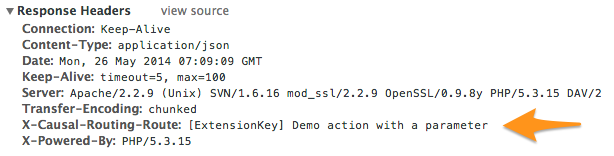

=======================
Request Routing Service
=======================

Service to route HTTP/REST requests to your own controller/actions.

**Good to know:** The routing is inspired by the way Flow's router works (`read more <http://docs.typo3.org/flow/TYPO3FlowDocumentation/2.1/TheDefinitiveGuide/PartIII/Routing.html>`_).

What does it do?
================

This extension lets you route requests like::

    http://localhost/routing/extension-key/my-demo/1234
    http://localhost/routing/extension-key/my-demo/1234.json
    http://localhost/routing/extension-key/my-demo/99

to any controller/action based on a YAML-based routing configuration. In this example,
where ``1234`` and ``99`` will be mapped to some method argument (and converted to domain object if needed) and
``json`` will set the response format to ``json``.

Sample Routing
--------------

The routing is stored as ``Configuration/Routes.yaml`` and looks like that::

    -
      name: 'Demo action with a parameter in a given format (JSON, ...)'
      uriPattern: 'my-demo/{value}.{@format}'
      defaults:
        '@package':    'MyVendor.ExtensionKey'
        '@plugin':     'API'
        '@controller': 'Dummy'
        '@action':     'demo'
    -
      name: 'Demo action with a parameter'
      uriPattern: 'my-demo/{value}'
      defaults:
        '@package':    'MyVendor.ExtensionKey'
        '@plugin':     'API'
        '@controller': 'Dummy'
        '@action':     'demo'

The name of the route is sent as additional header in the response:

Installation
============

#. Clone this repository into `typo3conf/ext/routing`::

       $ cd /path/to/typo3conf/ext/
       $ git clone https://github.com/xperseguers/t3ext-routing.git routing

#. Go to Extension Manager and activate extension ``routing``

#. Add a rewrite rule to your ``.htaccess``::

       RewriteRule ^routing/(.*)$ /index.php?eID=routing&route=$1 [QSA,L]

   or, if you are using Nginx::

       rewrite ^/routing/(.*)$ /index.php?eID=routing&route=$1 last;

   This will have the effect of using this extension for handling requests starting with ``routing/``.

.. tip::
    If you need to support localization (``&L=<some-language-uid>``), then you should change the suggesting routing above
    to include the root page uid of your website (``&id=<some-uid>``). This is needed because localization mode and default
    default language may differ in complex environments and thus cannot be inferred.

Read more in the `manual <http://docs.typo3.org/typo3cms/extensions/routing/>`_.
